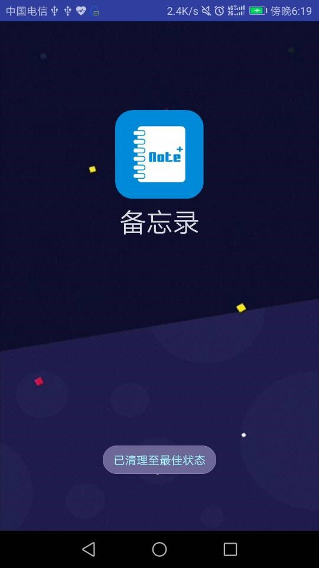
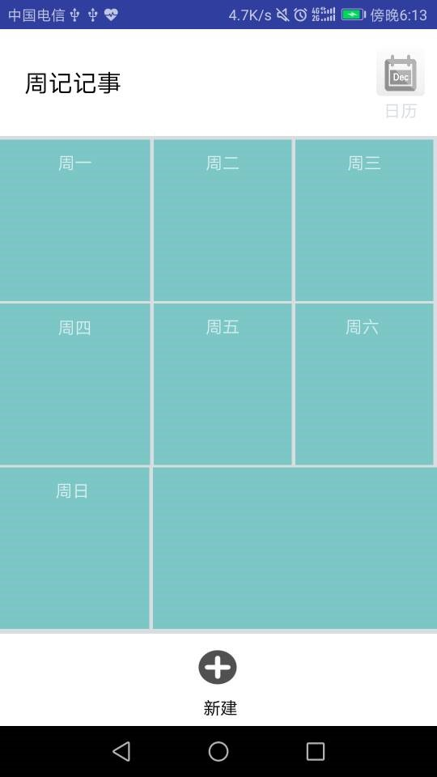
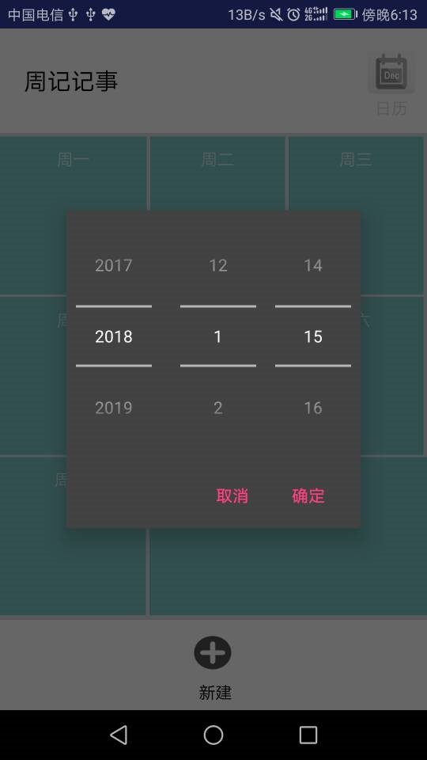
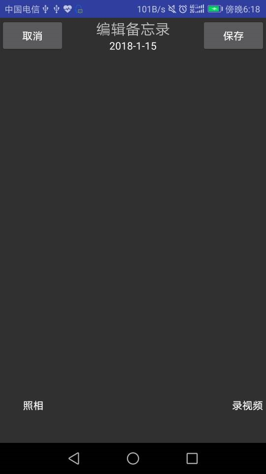
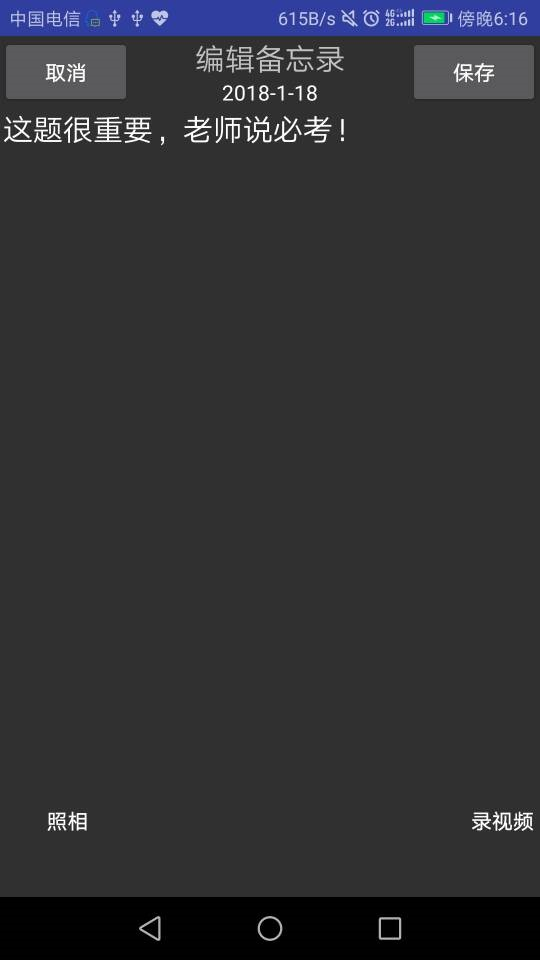
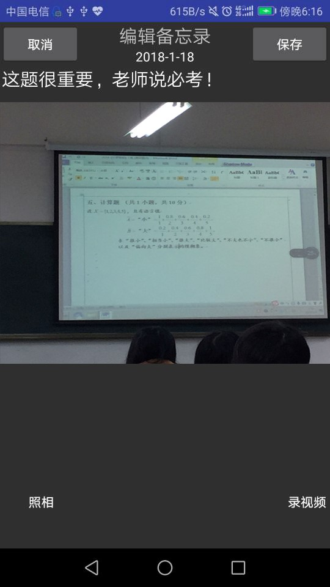
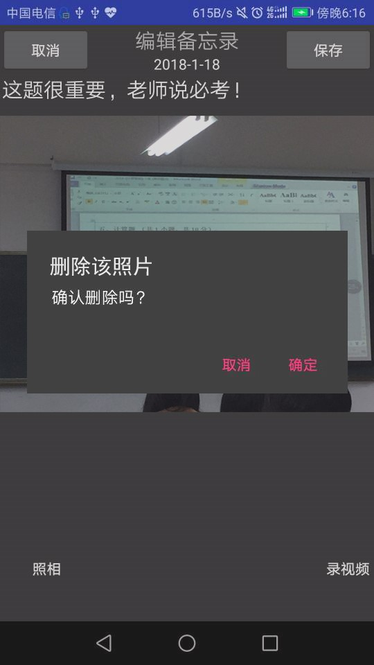
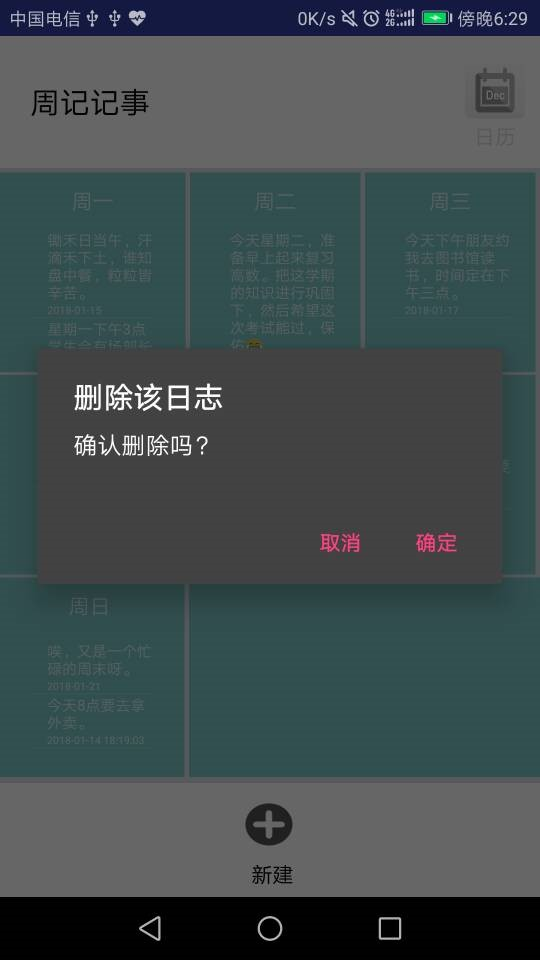
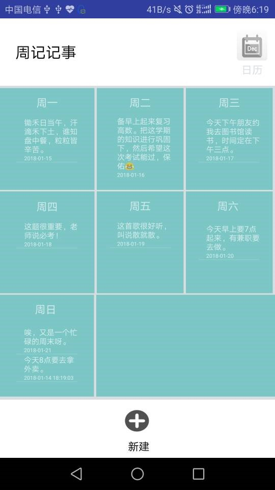
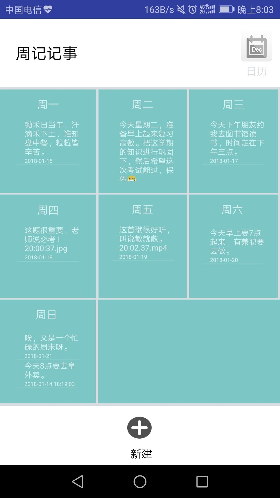

​	此次编写的notepad是一个能够辅助人们实现记录重要事件的记事备忘录APP，它可以将未来一周或几周内的重要事情记录保存下来并随时查看。有添加、删除、编辑记事的功能，同时在记录事件的时候可以辅以图片、视频等多媒体形式进行记录。 


​	当APP开启后读取数据的界面（闪屏界面）在这个时候，后台会读取数据库里的数据并呈现在主界面中。 




​	考虑到本记事最初的设计就是基于周期性的记事，将未来一周或者一段时间需要记录的事情以周记录的方式，清晰明了，直观易懂地呈现给APP使用者。用户可以通过右上角的日历功能，点击选择事情要发生的日期，然后记录下来，之后其保存的记事会被记录到一周内的相应内容框中。




```
@Override
    protected void onCreate(Bundle savedInstanceState) {
        // TODO Auto-generated method stub
        super.onCreate(savedInstanceState);
        // 设置无标题
        requestWindowFeature(Window.FEATURE_NO_TITLE);
        setContentView(R.layout.two_activity);
        btn1=(Button)findViewById(R.id.addphoto) ;
        btn2=(Button)findViewById(R.id.addvideo);
        btn1.setOnClickListener(new mybutton());
        btn2.setOnClickListener(new mybutton());

        et_content = (EditText) findViewById(R.id.et_content);
        // 设置软键盘自动弹出
        getWindow().setSoftInputMode(
                WindowManager.LayoutParams.SOFT_INPUT_STATE_ALWAYS_VISIBLE);

        DB = new NotesDB(this);
        dbread = DB.getReadableDatabase();
        Bundle myBundle = this.getIntent().getExtras();
        if((myBundle.getString("years"))==null) {
            tv_date = (TextView) findViewById(R.id.tv_date);
            date1 = new Date();
            SimpleDateFormat sdf = new SimpleDateFormat("yyyy-MM-dd HH:mm");
            String dateString = sdf.format(date1);
            tv_date.setText(dateString);
            last_content = myBundle.getString("info");
            et_content.setText(last_content);
        }
        else
        {
            tv_date = (TextView) findViewById(R.id.tv_date);
            years=myBundle.getString("years");
            int year=   Integer.parseInt(years);
            months=myBundle.getString("months");
            int month= Integer.parseInt(months);
            days=myBundle.getString("days");
            int day=Integer.parseInt(days);
            last_content = myBundle.getString("info");
            String dateString=years+"-"+months+"-"+days;
            tv_date.setText(dateString);
            date1=new Date(year-1900,month-1,day);
        }

        // 确认按钮的点击事件
        btn_ok = (Button) findViewById(R.id.btn_ok);
        btn_ok.setOnClickListener(new OnClickListener() {
            public void onClick(View arg0) {
                // 获取日志内容
                String content = et_content.getText().toString();
                Log.d("LOG1", content);
                // 获取写日志时间
                SimpleDateFormat sdf = new SimpleDateFormat("yyyy-MM-dd HH:mm:ss");
                String dateNum = sdf.format(date1);
                String sql;
                String sql_count = "SELECT COUNT(*) FROM note";
                SQLiteStatement statement = dbread.compileStatement(sql_count);
                long count = statement.simpleQueryForLong();
                Log.d("COUNT", count + "");
                Log.d("ENTER_STATE", ENTER_STATE + "");
                // 添加一个新的日志
                if (ENTER_STATE == 0) {
                    if (!content.equals("")) {
                        sql = "insert into " + NotesDB.TABLE_NAME_NOTES
                                + " values(" + count + "," + "'" + content
                                + "'" + "," + "'" + dateNum + "')";
                        Log.d("LOG", sql);
                        dbread.execSQL(sql);
                    }
                }
                // 查看并修改一个已有的日志
                else {
                    Log.d("执行命令", "执行了该函数");
                    String updatesql = "update note set content='"
                            + content + "' where _id=" + id;
                    dbread.execSQL(updatesql);
                    // et_content.setText(last_content);
                }
                Intent data = new Intent();
                setResult(2, data);
                finish();
            }
        });
        btn_cancel = (Button) findViewById(R.id.btn_cancel);
        btn_cancel.setOnClickListener(new OnClickListener() {
            public void onClick(View arg0) {
                finish();
            }
        });
    }
    class mybutton implements OnClickListener
    {
        @Override
        public void onClick(View v) {
            switch (v.getId())
            {
                case R.id.addphoto:take_photo();break;
                case R.id.addvideo:
            }
        }
    }

    private void take_photo() {
        startActivity(new Intent(noteEdit.this,photo_activity.class));
    }

    @Override
    protected void onActivityResult(int requestCode, int resultCode, Intent data) {
      }
    }
}
```

​	打开日历功能可以选择在指定日期进行记事。




​	

​	新建记事和编辑记事的界面。点击日历后显示的是选定时间，点击新建记事时间会自动默认为编辑记事的当天。进入该页面后可以选择以文字、照片、录视频多种方式进行记事，并进行保存，然后返回主界面就可以看到添加的记事信息。

​	                       


​	添加记事时，是对空白内容进行添加，编辑记事时则是对已经添加的事件进行修改。在编辑记事时，点击左下角按钮，会自动调用系统照相机，拍摄下需要记录的图片并显示在当前编辑页面，而拍摄的图片也会自动保存到系统相册里新建的notemedia文件夹中，若拍摄照片不符合要求或者想要进行替换，在编辑界面中长按图片则会提示是否删除图片。 

```

public class photoviewer extends Activity {
    @Override
    protected void onCreate(@Nullable Bundle savedInstanceState) {
        super.onCreate(savedInstanceState);

        iv = new ImageView(this);
        setContentView(iv);

        String path = getIntent().getStringExtra(EXTRA_PATH);
        if(path!= null){
            iv.setImageURI(Uri.fromFile(new File(path)));
        }else {
            finish();
        }
    }
    private ImageView iv;
    public static final String EXTRA_PATH ="path";
}
```








​	在编辑记事时，点击右下角按钮，会自动调用系统录像的软件（一般相机会自带录像功能），录制下需要记录的视频并显示在当前编辑页面，点击视频缩略图中的播放按钮，则会自动适应屏幕进行播放，而录制下来的视频也会自动保存到系统相册里新建的notemedia文件夹中，若录制的视频不符合要求或者想要进行替换，长按视频缩略图则会提示是否删除视频。 

```
public class videoviewer extends Activity {
    @Override
    protected void onCreate(@Nullable Bundle savedInstanceState) {
        super.onCreate(savedInstanceState);
        vv = new VideoView(this);

        vv.setMediaController(new MediaController(this));
        setContentView(vv);

        String path = getIntent().getStringExtra(EXTRA_PATH);
        if(path!= null){
            vv.setVideoPath(path);
        }else {
            finish();
        }
    }

    private VideoView vv;
    public static final  String EXTRA_PATH ="path";
}
```


​		

​	当想要对整个记事进行删除，则可以在主界面中，选定想要删除的记事则可以删除指定的日期的记事。 



​	

​	当新建记事或者编辑完记事后，会自动根据所指定添加的日期添加到相应日期栏内。对应的内容也会显示在每一块中，图片和视频的显示方式为“创建时间”+“.jpg”或者“.mp4” 

```
public class NotesDB extends SQLiteOpenHelper {

    public static final String TABLE_NAME_NOTES = "note";
    public static final String COLUMN_NAME_ID = "_id";
    public static final String COLUMN_NAME_NOTE_CONTENT = "content";
    public static final String COLUMN_NAME_NOTE_DATE = "date";

    public NotesDB(Context context) {
        super(context, "note", null, 1);
        // TODO Auto-generated constructor stub
    }

    @Override
    public void onCreate(SQLiteDatabase db) {
        String sql = "CREATE TABLE " + TABLE_NAME_NOTES + "(" + COLUMN_NAME_ID
                + " INTEGER PRIMARY KEY AUTOINCREMENT,"
                + COLUMN_NAME_NOTE_CONTENT + " TEXT NOT NULL DEFAULT\"\","
                + COLUMN_NAME_NOTE_DATE + " TEXT NOT NULL DEFAULT\"\"" + ")";
        Log.d("SQL", sql);
        db.execSQL(sql);
    }
    @Override
    public void onUpgrade(SQLiteDatabase arg0, int arg1, int arg2) {
        // TODO Auto-generated method stub
    }
}

```



